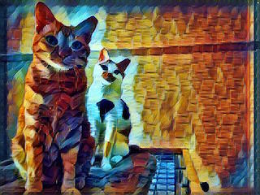

  I set out a few weeks ago a person with a grand and beautiful mission: to scrape the [**National UFO Reporting Center Database**](http://www.nuforc.org/webreports.html). As we are all aware, [**The Truth is Out There**](https://www.youtube.com/watch?v=rbBX6aEzEz8), and as a statistician trying to learn python for data analysis and data science purposes, I wanted to find The Truth through data.

Not a true beginner to Python, I had some ideas about how I might go about scraping the database. Data mining from the web is one of my overarching goals for my time in the [**ChiPy mentorship program**](https://chipymentor.org/). So, fresh and as green as what an alien could look like (who’s to be sure) I started learning [**Scrapy**](https://www.scrapy.org). I followed their tutorials, which included learning how to utilize a virtual environment on my computer. <br>


1. *How to setup a virtual environment*: I learned this by googling it, but now I’m enough of a pro to satisfy my deeply ingrained perfectionism. I had used virtual environments inside [**cloud9**](https://c9.io/), an interactive programming tool that I’ve used taking [**rmotr.com**](https://www.rmotr.com) classes, but had not done it on my computer yet.

2. *The need for more precise language*: On a call with Arpit, my mentor, I made the mistake of saying: “Oh I used a virtual machine for Scrapy”, at which point he was like “...I truly doubt it.” (I may have taken some leeway in representing what he said, but bear with me.) He then proceeded to explain to me the difference between a virtual machine and a virtual environment, which I will not besmirch his good name further and try to reproduce verbatim here. As a statistician, I understand that accuracy in language is crucial. It grinds my gears every time someone uses correlation when they mean association, and don’t get me started on multivariate versus multivariable. Being more precise in my language will help me communicate with other coders in the future.

If you hadn’t guessed by clicking the link and looking at the NUFORC database, Scrapy wasn’t going to do it on the scraping front. I discovered very quickly that the database is about the closest thing to plain text as HTML can be. If I had read the Scrapy tutorial before I started it, I would have realized the next thing on my list.

3. *Read an entire tutorial before you start it*: the Scrapy tutorial in the documentation teaches you how to create a spider that crawls webpages targeting specific CSS tags. The NUFORC database has no CSS, something that’s evident on-sight. I don’t consider my time spent writing a web spider in Scrapy to be time wasted, because it’s the beginning of a valuable skill I believe I will use in future work. However, I could have saved myself a lot of time and frustration if I had read the entire tutorial before beginning. 

I was first introduced to coding when I took a 2 semester Intro to Java in 2012. From there, I learned SAS and R as I was getting my Master's degree. I am all too aware that I take for granted the fact that I know enough Python (and the other languages I know, sometimes) to read and understand it, even if I can't write it off the top of my head. 

4. *Don't underestimate the small stuff*: Working on this project so far, I've gotten a lot more comfortable using Atom. I've written programs in Atom and executed them from my terminal. I'm actually learning how to navigate the command line and what cd actually *means* (which, how did I not get that before??), rather than googling and copying directly. I'm picking things up, little by little, and that's such a crucial part of this process. 

#Some things I learned on purpose:

1. *API client*: With a partner, I built a client for interacting with the [**Star Wars API**](https://swapi.co/). This is one of the assignments for rmotr.com’s Advanced Python course, and you can see my code in [**this GH repository:**](https://github.com/klmedeiros/pyp-w2-gw-starwars-api). This was my first real introduction to APIs, other than hearing the word tossed around a lot, and it proved swiftly to not be my last tango with the ol' application program interface(s) of the world. As per #4 above, this was the first program I helped write where I remembered to use .format(), a la:
```{python}
        # return 'PeopleQuerySet: {0} objects'.format(str(len(self.objects))
```
I know the code probably isn't that exciting to see out of context, and I had to comment it out so R didn't have a cow, but I remembered to use format statements and I'm proud of myself. I'm fortunate to have received a scholarship through [**Women Who Code**](https://www.womenwhocode.com/) prior to being selected for ChiPy to take rmotr.com's Intro Python course, and Rmotr themselves generously supported me to pursue the Advanced course, where I also helped build a decorators library, a clone of Twitter complete with an API, a tic-tac-toe game, and more.


2. *Networking and TensorFlow*: I attended the Google International Women’s Day 2017 [**Women Techmakers Summit,**](https://www.womentechmakers.com/iwd17) where I selected the ‘Introduction to TensorFlow’ workshop for my afternoon session. We used pretrained models in Jupyter notebooks to make some art (see below), built a simple linear regression model, and even did some basic analysis with the classic MINIT digit recognition database. I was only able to attend this workshop because of the familiarity I’ve gained with Python during rmotr’s courses and my meetings with Arpit, and we hope to integrate TensorFlow into our project so we can both learn more about it.

<center>  </center>
<br>

We utilized TF through a Docker container, which was an excellent first exposure to Docker, another thing I've had to use more of my newfound command line knowledge to use. It's come in handy as my next purposeful learning opportunity came along. <br> 

3. *Got a new side gig*: At my new freelance Data Scientist gig (moving on up in the world, y'all), I write R code, create an API endpoint in a Jupyter notebook which acts as a "worker" for a program of interconnected workers, all performing different parts of a complete statistical analysis. The workers are connected in a program built in Python, and once I'm more competent at building the endpoints, I get to help on that program too. I've seen some of the code and it's going to be challenging, and I truly can't wait. 

#Regarding our Actual ChiPy Mentorship Project
Even before I set out to scrape the NUFORC, I knew dataset was already on [**Kaggle**](https://www.kaggle.com/NUFORC/ufo-sightings) and was additionally available in this [**GitHub repository.**](https://github.com/planetsig/ufo-reports). I still wanted to try my hand at scraping, and Arpit is working on an actual solution using BeautifulSoup right now. 

I'm currently working on descriptive data analysis using numPy and Pandas. We plan to regroup this weekend and do scoping and decide how big our project can really be in the next few months. We'd love to do some prediction using TensorFlow and other machine learning methods. The dataset is large: about 80k sightings, and the dataset on Kaggle is also geocoded. My specific goals over the course of the ChiPy Mentorship Program include:

1. Become proficient in numPy, Pandas, Seaborn, and matplotlib

2. Start to get familiar with scikit-learn's methods of doing machine learning (excellent because I'll basically be doing the same methods in tandem in R for my side gig)

3. Continue learning how to utilize TensorFlow to explore my interest in deep learning, either with the NUFORC data or complementary data

4. Actually scrape a relevant website to collect useful information

5. Create a cool portfolio project to showcase both my strong statistical base and my newfound Python skills, care of my mentor Arpit and the other participants in the spring 2017 ChiPy Mentorship Program.  
<center></center>