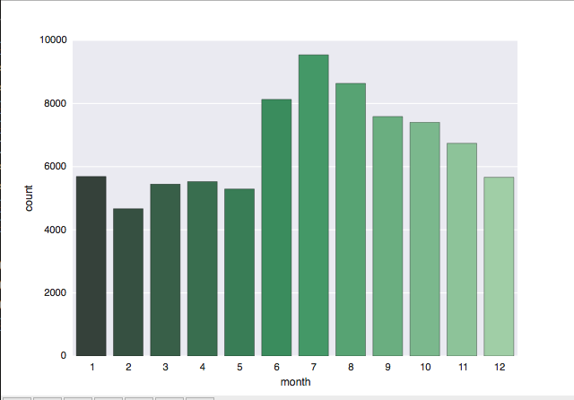
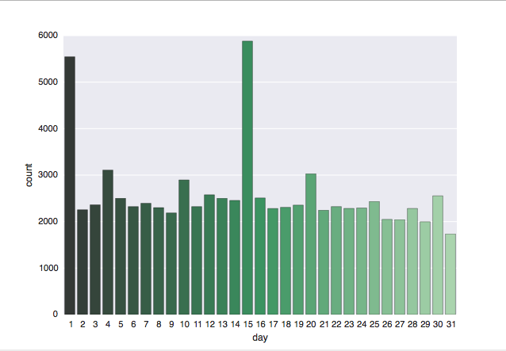

Full disclosure, fellow ChiPys: I'm a statistician by trade. I have an MS in Biostatistics, which means I have a statistics degree but was trained in a school of public health on health data and problems, and have worked for the last year as a statistician, with a transition at the end of May planned to work as a data scientist. I've used SAS and R extensively in my work both in graduate school and career thus far, but very little Python. <br>

As a result of knowing SAS and R, both cleaning the data and writing this blog were exercises in futility, in a way: much of my time was spent knowing the name of what I wanted to do, how to do it in SAS and/or R, and Googling to figure out how to do it in Python. As my mentor Arpit put it, I knew the "parallel universe definition" of most everything I wanted to do, and had to figure out the best way to implement it in Python. I initially wrote this code in a Jupyter Notebook.<br>

As a reminder, I'm dealing with the [**National UFO Reporting Center Database**](http://www.nuforc.org/webreports.html) data, as downloaded from [**Kaggle**](https://www.kaggle.com/NUFORC/ufo-sightings). The NUFORC got a mention on the [**New York Times**](https://www.nytimes.com/2017/04/24/science/ufo-sightings-book.html?_r=0) last month, so obviously I'm in the right place. Our goal for the project is to ultimately take the data out into TensorFlow and play around with doing some prediction.<br>

On Kaggle, the data is available both as 'Complete' and 'Scrubbed'. The scrubbed dataset has any entry where location not found or blank plus those with blank or erroneous time removed, and I elected to use that as I worked through the cleaning.<br>

The biggest issue I ran into early on in cleaning: the sightings in the NUFORC database go back to the 1800s, and when using the dt.year function below on the 'scrubbed' dataset as downloaded, it converted many dates to ones that might seem...a little odd, like 2025, which to my knowledge has not yet happened in this particular slice of multiverse. To be totally honest--and this is the kind of thing I've done in my professional life as well--I cheated and used Excel to split the dates and times apart. When I did that, dt.year converted the years correctly, and I was good to go from there. One thing I've learned in the last year is that it isn't always worth it to spend hours on a solution in code when a quick fix is available. This might not be the best example of a good situation to apply that principle, but I did it, and I'm okay with it.<br>

I wanted to go through my cleaning step-by-step, but in R, you have to keep re-importing packages and the data in each code block, so I'll put a large portion of it below, with comments in the code. This blog is intended to be a high-level overview of my cleaning, so not all of the code will be here. <br>

```{python}
import pandas as pd
import numpy as np

#import the dataset, using read_csv from pandas
nuforc = pd.read_csv('./scrubbedB.csv', na_values=['.'], low_memory=False)

#data cleaning, dates
nuforc['date'] = pd.to_datetime(nuforc['date'], errors='coerce')
nuforc.insert(1, 'year', nuforc['date'].dt.year)
nuforc['year'] = nuforc['year'].fillna(0).astype(int)
nuforc.insert(2, 'month', nuforc['date'].dt.month)
nuforc.insert(3, 'day', nuforc['date'].dt.day)

#clean up other columns
nuforc['city'] = nuforc['city'].str.title()
nuforc['state'] = nuforc['state'].str.upper()
nuforc['country'] = nuforc['country'].str.upper()
nuforc['latitude'] = pd.to_numeric(nuforc['latitude'], errors='coerce')
nuforc = nuforc.rename(columns={'longitude ':'longitude'})
nuforc['date posted'] = pd.to_datetime(nuforc['date posted'], errors='coerce')

#now examine datatypes
print(nuforc.dtypes)
```


I first learned, very quickly, that I should import pandas *as* pd and numpy *as* np. My first run-through cleaning, I didn't do this, and it made life complicated to impossible. I cleaned dates and times as described above, and broke apart day, month, and year to make some graphs, which I'll show later. <br>

For the next chunk, I used a technique called 'binning' to deal with the duration in seconds of the UFO spot. The information on binning came from an excellent resource, the blog of a data scientist Chris Albon, found [**here**](https://chrisalbon.com/python/pandas_binning_data.html). I based my bins in this code on the quartiles of the duration (seconds) variable, but plan to make a few different versions with this method for use in modeling, utilizing bins of different sizes. <br>

```{python}
import pandas as pd
#import the dataset again
nuforc = pd.read_csv('./scrubbedB.csv', na_values=['.'], low_memory=False)

nuforc['duration (seconds)'].describe()
#HUGE range here of times. 

#Define times for the bins:
bins = [0, 30, 180, 600, 97836000]

#Create group names:
group_names = ['Q1', 'Q2', 'Q3', 'Q4']

#Cut the duration (seconds) variable
duration_cats = pd.cut(nuforc['duration (seconds)'], bins, labels=group_names)
nuforc['duration_cats'] = pd.cut(nuforc['duration (seconds)'], bins, labels=group_names)

#display a few, to demonstrate:
print(duration_cats[1])
print(duration_cats[10000])

```

Another interesting piece of cleaning I performed on this dataset was on the 'shape' variable. In the raw data, this variable has 29 unique categories (too many!), as displayed below, with frequency counts attained from the value_counts() function: <br>
light        16565* <br>
triangle      7865* <br>
circle        7608* <br>
fireball      6208* <br>
other         5649* <br>
unknown       5584* <br>
sphere        5387* <br>
disk          5213* <br>
oval          3733* <br>
formation     2457* <br>
cigar         2057* <br>
changing      1962* <br>
flash         1328* <br>
rectangle     1297* <br>
cylinder      1283* <br>
diamond       1178* <br>
chevron        952* <br>
egg            759* <br>
teardrop       750* <br>
cone           316* <br>
cross          233* <br>
delta            7* <br>
crescent         2* <br>
round            2* <br>
flare            1* <br>
pyramid          1* <br>
dome             1* <br>
hexagon          1*  <br>
changed          1* <br>

As you can imagine, this isn't helpful in any way. I decided to regroup these, because a triangle is sort of like a pyramid, changed can safely (in my opinion) be equated with changing, an egg is like a teardrop, etc. I took it down to 10 types, as listed below: <br>
changing = changed, changing<br>
unknown = unknown<br>
other = other, cross, hexagon (I stuck shapes I didn't know what else to do with them here)<br>
light_related =light, flare flash (these are related to quality of light, and not technically a shape, but I'm rolling with it)<br>
formation = formation (I think this means "multiple UFOs spotted" but I'm not totally sure)<br>
triangular = triangle, delta, pyramid, cone<br>
ovular = oval, cigar, teardrop, egg, fireball<br>
round = circle, sphere, disk, round, dome, cylinder<br>
bent = chevron, crescent<br>
rectangular = rectangle, diamond <br>

Since this is a bit of a fancy replacement, I did so by mapping values with a dictionary, as below:
```{python}
#is a lot more complicated replace than usual, so we're going to get fancy:
import pandas as pd
#import the dataset again
nuforc = pd.read_csv('./scrubbedB.csv', na_values=['.'], low_memory=False)

#dict must include every single value, even if mapping to the same category!!
dict = {'changed':'changing', 'changing':'changing', 'cross':'other', 'hexagon':'other',
        'light':'light_related', 'flare':'light_related', 'flash':'light_related', 
        'triangle':'triangular', 'delta':'triangular', 'pyramid': 'triangular', 
        'cone': 'triangular', 'oval':'ovular',         
        'cigar':'ovular','teardrop':'ovular','egg':'ovular','circle':'round',
        'sphere':'round','disk':'round','dome':'round','cylinder':'round','chevron':'bent', 
        'crescent':'bent', 'rectangle':'rectangular','diamond':'rectangular', 
        'fireball':'ovular','unknown':'unknown', 'other':'other', 'formation':'formation', 'round':'round'}
#actual mapping below:
nuforc['clean_shape']=nuforc['shape'].map(dict)

print(nuforc['clean_shape'].value_counts())
```

These look a lot cleaner and easier to work with, so I hope to use these moving foward, but may also make a second with further collapsed categories. <br>

One of the visualization-based cleaning exercises I undertook was to make some basic frequency plots in matplotlib. I wanted to see frequencies of UFO spots across both the months of the years and the days of the month to try and spot patterns. I used the documentation for Seaborn to build these, which I found very helpful and thorough.<br>

```{python}
#import again, plus seaborn
import pandas as pd
import seaborn as sns
#import dataset again
nuforc = pd.read_csv('./scrubbedB.csv', na_values=['.'], low_memory=False)
#data cleaning, dates, part 2
nuforc['date'] = pd.to_datetime(nuforc['date'], errors='coerce')
nuforc.insert(1, 'year', nuforc['date'].dt.year)
nuforc['year'] = nuforc['year'].fillna(0).astype(int)
nuforc.insert(2, 'month', nuforc['date'].dt.month)
nuforc.insert(3, 'day', nuforc['date'].dt.day)

#make a histogram of months
sns.countplot(x="month", data=nuforc, palette="Greens_d");
sns.plt.show()

#histogram of days
sns.countplot(x="day", data=nuforc, palette="Greens_d");
sns.plt.show()
```

<center></center>
<center></center>
I was not surprised to see the results of the Month plot, which showed the highest number of UFO spots during the United States' summer and fall months of June through October, when I'd guess more people are outside. The low number of spots from December through February are also pretty standard. I did find it sort of strange on the Day plot that spots peak on the 1st and 15th of the month, but remain pretty constant at all other days of the month. I don't have a working theory for that yet, but expect to have one as I go.<br>

Again, this wasn't all of the cleaning I conducted on this data, but is instead a highlight of the more interesting bits of cleaning for me as someone who knows SAS and R. One trend I noticed as I was working is that across nearly all the variables there are so many UFO spots of so many different types that everything is fairly uniform. This is going to prove to be a very interesting challenge when it comes to modeling, and specifically it's a challenge that means we may not find any "useful" or "meaningful" or even "reasonable" results. We will, however, learn a lot along the way!<br>

Next steps include more visualization, basic models (GLMs), then some machine learning models using scikitlearn and hopefuly TensorFlow. Arpit and I both hope to learn more about using TF, so that's a joint goal we have moving into the last month of the Mentorship program. As always, remember, [**The Truth is Out There**](https://www.youtube.com/watch?v=rbBX6aEzEz8).
